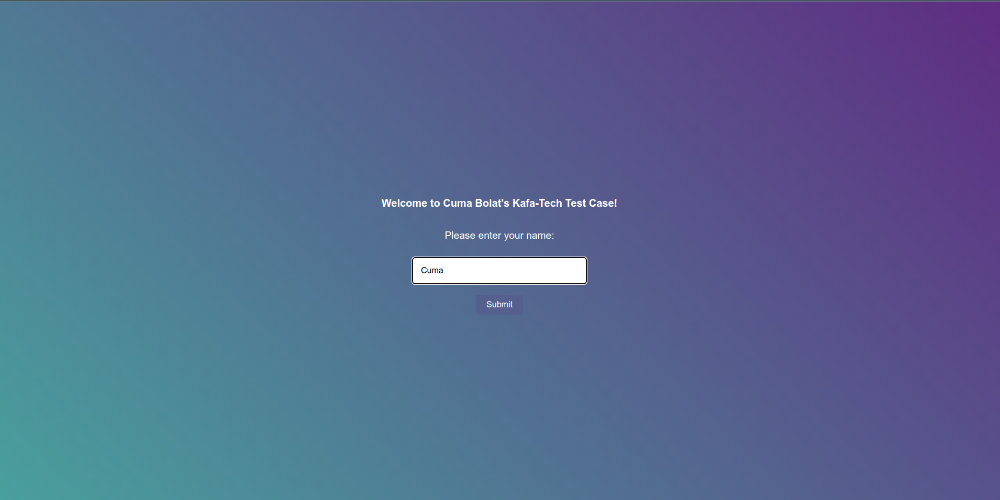
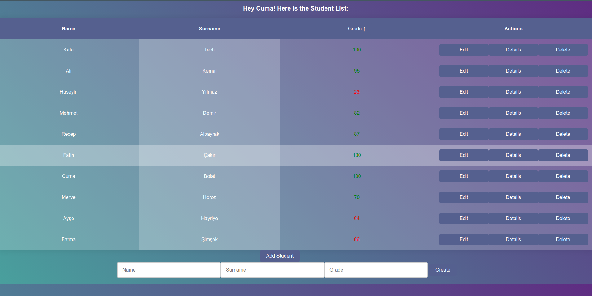

# Cuma Bolat Kafa-Tech's Pre Test

## Technologies Used
- Backend: Java, Spring
- Frontend: Javascript, React, HTML and CSS
- Database: SQL

## Features
- Adding students
- Deleting students
- Updating students
- Listing Students

## How to Run
  ```bash
  git clone git@github.com:CumaBolat/kafatech.git
  cd kafatech
  mvn spring-boot:run
  ```
  Since I integrated frontend with the backend, no need to run each other seperately.
  Then go to http://localhost:8080

  If you want to run both frontend and backend seperately;

  ```bash
  git clone git@github.com:CumaBolat/kafatech.git
  cd kafatech
  mvn spring-boot:run
  # open another terminal
  cd /src/main/frontend
  npm install # install necessary dependencies
  npm start
  ```
  From here, when the React app is ready, it will automatically navigate you to http://localhost:3000

## Schema
```bash
CREATE TABLE Student (
    id BIGINT PRIMARY KEY AUTO_INCREMENT,
    name VARCHAR(255),
    last_name VARCHAR(255),
    grade INT
);

# small database for a small project..
```

## Screenshots



## Facts About This Project
- This project was created under 3 hours.
- The database used in this project is an embedded Java Database called H2. I've choosen it because it's lightweight and easy to use.
